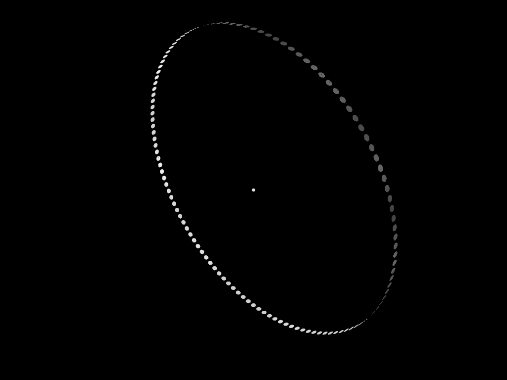
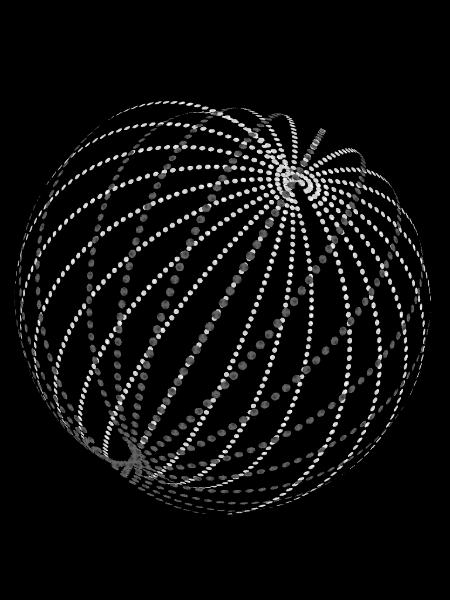
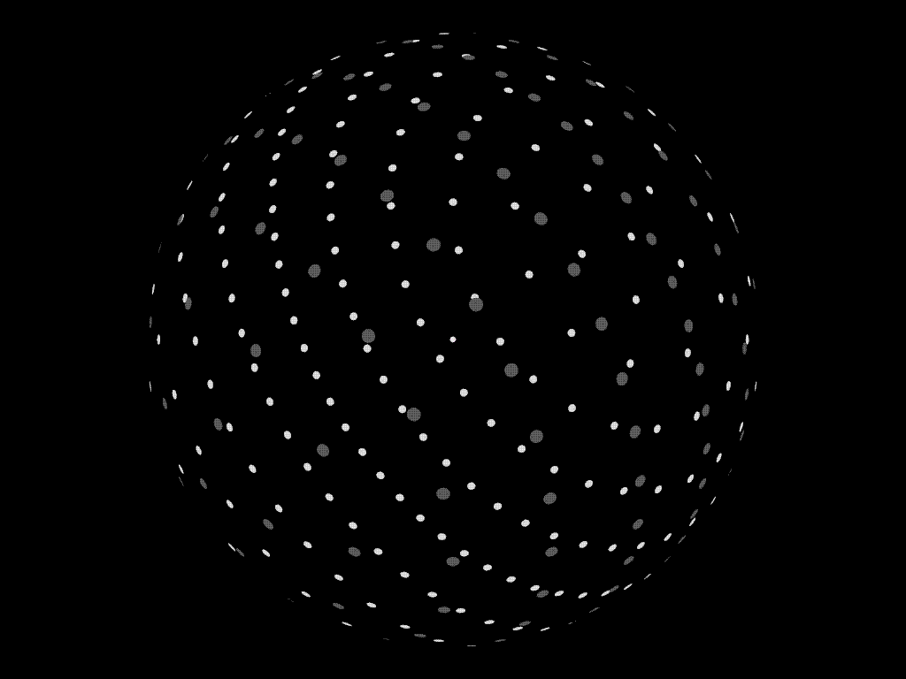
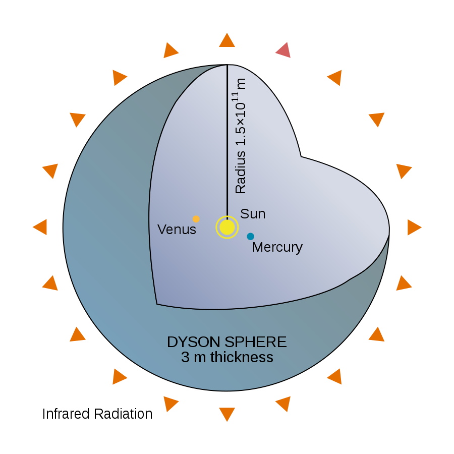

# 戴森球

[返回Wiki Mirror主页](https://ap1028.github.io/wiki-mirror/)

[Wikipedia链接](https://en.wikipedia.org/wiki/Dyson_sphere)

             
对使用固态戴森环的戴森球的3D渲染
 

**戴森球**是一个假设的[巨型结构](https://en.wikipedia.org/wiki/Megastructure)，它完全包围一颗[恒星](https://en.wikipedia.org/wiki/Star)并捕获其大部分[太阳能](https://en.wikipedia.org/wiki/Solar_power)输出。这个概念是一个[思想实验](https://en.wikipedia.org/wiki/Thought_experiment)，试图解释一个[进行太空飞行](https://en.wikipedia.org/wiki/Spacefaring)的文明在能量需求超过了从母星资源所能产生的能量时将如何满足其能量需求。由于恒星的能量辐射只有一小部分到达围绕其运转[行星](https://en.wikipedia.org/wiki/Planet)的表面，围绕恒星的结构将使[文明](https://en.wikipedia.org/wiki/Civilization)能够收获更多的能量。

在当代对该结构的第一个描述是[奥拉夫·斯台普登](https://en.wikipedia.org/wiki/Olaf_Stapledon)在他1937年发布的科幻小说[《造星者》](https://en.wikipedia.org/wiki/Star_Maker)中描述的“每个太阳系……都被一层光的陷阱包围，它聚焦逸出的太阳能并将其由智慧生命利用”。[[1](https://en.wikipedia.org/wiki/Dyson_sphere#cite_note-1)]这个概念后来被[弗里曼·戴森](https://en.wikipedia.org/wiki/Freeman_Dyson)在他 1960 年的论文“人工恒星[红外辐射](https://en.wikipedia.org/wiki/Infrared_Radiation)源的搜寻（Search for Artificial Stellar Sources of Infra-Red Radiation）”中推广。[[2](https://en.wikipedia.org/wiki/Dyson_sphere#cite_note-search-2)]戴森推测，这种结构将是技术文明不断升级的能源需求的必然结果，也是其长期生存的必要条件。他提出寻找这样的结构可能使我们发现先进、智能的[外星生命](https://en.wikipedia.org/wiki/Extraterrestrial_life)。不同类型的戴森球和它们的能量收集能力将对应于在[卡尔达肖夫指数](https://zh.wikipedia.org/wiki/卡尔达肖夫指数)水平上的技术进步。

从那时起，其他涉及通过建造人工结构或用一系列结构包围恒星的变体设计在[探索性工程](https://en.wikipedia.org/wiki/Exploratory_engineering)中被提出，并以“戴森球”的名字出现诸多[科幻小说](https://en.wikipedia.org/wiki/Science_fiction)中。后续的设想认为戴森球上不仅有[太阳能](https://zh.wikipedia.org/wiki/太阳能)电站，还有人类[殖民地](https://zh.wikipedia.org/wiki/殖民地)和[工业](https://zh.wikipedia.org/wiki/第二产业)基地存在。大多数虚构的构想都描述了一个包裹着恒星的固体[物质外壳](https://en.wikipedia.org/wiki/Dyson_sphere#Dyson_shell)，戴森自己认为这是这个设想最不可行的变体。2013 年 5 月，在圣地亚哥的星际飞船世纪研讨会上，戴森重复了他的评论，他希望这个概念没有以他的名字命名。[[3](https://en.wikipedia.org/wiki/Dyson_sphere#cite_note-3)]

## 目录

1. [概念起源](#概念起源)
2. [可行性](#可行性)
3. [变体](#变体)
   1. [戴森云](#戴森云)
   2. [戴森泡](#戴森泡)
   3. [戴森壳](#戴森壳)
   4. [其他类型](#其他类型)
      1. [戴森网络](#戴森网络)
      2. [泡世界](#泡世界)
      3. [恒星发动机](#恒星发动机)
      4. [尼文环](#尼文环)
4. [寻找巨型结构](#寻找巨型结构)
5. [小说](#小说)
6. [参见](#参见)
7. [参考文献](#参考文献)
8. [外部链接](#外部链接)

## 概念起源

另见：[能源开发](https://en.wikipedia.org/wiki/Energy_development)

    
     
    
2005年的弗里曼·戴森

戴森球的概念源自于[美国](https://zh.wikipedia.org/wiki/美國)物理学家、数学家[弗里曼·戴森](https://zh.wikipedia.org/wiki/弗里曼·戴森)的[思想实验](https://zh.wikipedia.org/wiki/思想實驗)。他认为，任何技术文明对能量的需求都是稳定增长的，如果人类文明能够延续足够长的[时间](https://zh.wikipedia.org/wiki/时间)，就必然有一天对能量的需求会膨胀到要利用其[太阳](https://en.wikipedia.org/wiki/Sun)“全部”的能量输出。他提出了一个轨道结构系统（他最初将其称为“壳(shell)”）旨在拦截和收集太阳产生的所有能量。戴森没有从细节上论述该结构如何建造，而只着眼于能量收集的问题，因为这种结构可以通过其不寻常的发射光谱同恒星区分。戴森在他1959年出版于[科学](https://zh.wikipedia.org/wiki/科学_(期刊))杂志的论文“**人工恒星红外辐射源的搜寻**（Search for Artificial Stellar Sources of Infra-Red Radiation）”中提出了这一概念，据信这是戴森球概念的首次正式提出。[[2](https://en.wikipedia.org/wiki/Dyson_sphere#cite_note-search-2)]

然而，戴森并不是第一个提出这个想法的人。他的灵感来自 [奥拉夫·斯特普尔顿](https://zh.wikipedia.org/wiki/奥拉夫·斯塔普雷顿)写于1937年的[科幻小说](https://zh.wikipedia.org/wiki/科幻小说)《[造星者](https://en.wikipedia.org/wiki/Star_Maker)》[[4](https://en.wikipedia.org/wiki/Dyson_sphere#cite_note-4)]，可能还受到[J·D·伯纳尔](https://en.wikipedia.org/wiki/J._D._Bernal)作品的启发。[[5](https://en.wikipedia.org/wiki/Dyson_sphere#cite_note-dsfaq-as-first-2012-01-5)]

## 可行性

虽然这样的巨型结构在理论上是可能的，但目前建造一个稳定的戴森球系统远远超出人类当前的工业生产能力。建造、传输能量和维护戴森球所需的航天器数量远远超出人类当前的工业生产能力。[George Dvorsky](https://en.wikipedia.org/wiki/George_Dvorsky)提倡在相对短期内使用[自我复制机器人](https://en.wikipedia.org/wiki/Self-replicating_robots)来克服这一限制。[[6](https://en.wikipedia.org/wiki/Dyson_sphere#cite_note-dvorsky2012-6)]一些人提议将这样的栖息地围绕[白矮星](https://en.wikipedia.org/wiki/White_dwarf#Habitability)[[7](https://en.wikipedia.org/wiki/Dyson_sphere#cite_note-7)]甚至[脉冲星](https://en.wikipedia.org/wiki/Pulsar)建造。[[8](https://en.wikipedia.org/wiki/Dyson_sphere#cite_note-8)]

## 变体

在虚构作品中，戴森球常常被描述成一个包围恒星的[人造空心球体](https://en.wikipedia.org/wiki/Sphere)。这是对戴森球原意的曲解。在回复有关他论文的信中，戴森说，“一个围绕恒星的球壳或环从物理上来说是不可行的。我设想的‘生物圈’的形式是由松散的太阳能收集器或独立环绕恒星轨道的卫星云构成。”[[9](https://en.wikipedia.org/wiki/Dyson_sphere#cite_note-9)]

### 戴森云

    
     
    
<b>戴森环</b>是戴森云最简单的结构。图中轨道半径为1天文单位，太阳能收集器的直径为1.0×107千米(10Gm或约25倍地月距离)，收集器中心围绕圆形轨道分隔3度均匀分布

    
     
    
<b>多戴森环</b>是戴森云的一个相对简单的结构。图中轨道半径为1天文单位，太阳能收集器的直径为1.0×107千米(约25倍地月距离)，环上收集器中心分隔3度均匀分布，环与环之间分隔15度均匀分布。

最接近戴森最初概念的变体是“戴森云”（Dyson swarm）。它由巨大数目的密集环绕恒星运行的独立结构（通常是[太阳能卫星](https://en.wikipedia.org/wiki/Solar_power_satellite)和[太空定居点](https://zh.wikipedia.org/wiki/宇宙殖民地)）组成。这种戴森球结构有这样几个优势：组成戴森群的元件可以自由调整数量和设计尺寸，这样便能在长时期内逐步建造。[[10](https://en.wikipedia.org/wiki/Dyson_sphere#cite_note-canbuild-10)]不同形式的[无线能量传输](https://zh.wikipedia.org/wiki/无线能量传输)形式可以用于结构之间的能量传递。

戴森云也有其劣势。[轨道力学](https://zh.wikipedia.org/wiki/航天动力学)规律决定了戴森云的轨道排布将会极度复杂。最简单的排布方式莫过于戴森环，在这种布置中，所有太阳能收集器共享同一个轨道。复杂的多环模式可以拦截到更多恒星能量输出，但环轨道重叠时会造成周期性的[食](https://zh.wikipedia.org/wiki/食_(天文現象))。[[11\]](https://en.wikipedia.org/wiki/Dyson_sphere#cite_note-11)另外潜在的问题是，增加轨道结构会加强对其他结构的[摄动](https://zh.wikipedia.org/wiki/攝動)，从而降低轨道的稳定性。

[下文](#寻找巨型结构)会继续提到，这样一个收集器“云”将会改变恒星系统向宇宙发射的光线。然而，与恒星的整体自然发射的光谱相比，这种改变很可能太小，以至于地球上的天文学家无法观察到它。[[2](https://en.wikipedia.org/wiki/Dyson_sphere#cite_note-search-2)]

### 戴森泡

    
     
    
<b>戴森泡</b>是一种非轨道类型的静态卫星排列方式。只要恒星的光线能够无障碍地抵达，收集器就能停留在恒星附近的任何位置。这种相对简单的排布方式是唯一能够布置无限多收集器的方式。图中所有的太阳能收集器的直径为1.0×107千米(约25倍地月距离)，距离恒星1天文单位

戴森球的第二种形式是“戴森泡”（Dyson bubble）。它类似于戴森云，由许多独立的结构组成，同样也可以逐步地进行建造。

不同于戴森云，此方案不是用环绕轨道的方法，而是使用[静态卫星]((https://en.wikipedia.org/wiki/Statite))——通过巨大的承受[光压](https://zh.wikipedia.org/wiki/光壓)的[太阳帆](https://zh.wikipedia.org/wiki/太阳帆)来抵消太阳的引力而悬浮的卫星。这样的结构可以免于冲撞以及[食](https://zh.wikipedia.org/wiki/食_(天文現象))的危险；各个结构对于母恒星来说可能是完全静止的，并且相互独立。由于光压和恒星引力之比是恒定的，与[距离](https://zh.wikipedia.org/wiki/距离)无关（假设太阳帆卫星与太阳的连线上没有被其他物体[[12](https://en.wikipedia.org/wiki/Dyson_sphere#cite_note-12)]），此类静止卫星可以自由调整其与中心恒星的距离。

按照现代[材料科学](https://zh.wikipedia.org/wiki/材料科学)的能力，该方法实践起来仍存在问题，但是有潜力达到。环绕母恒星的太阳帆卫星需要一个总[密度](https://zh.wikipedia.org/wiki/密度)为0.78克/平方米的帆。[[13](https://en.wikipedia.org/wiki/Dyson_sphere#cite_note-stable-13)]为便于阐明所需材料不需要很大质量，想象一下半径为1[天文单位](https://zh.wikipedia.org/wiki/天文單位)的单个戴森泡的质量仅为2.17×1020千克，这仅相当于[小行星](https://zh.wikipedia.org/wiki/小行星)[智神星](https://zh.wikipedia.org/wiki/智神星)的质量。[[14](https://en.wikipedia.org/wiki/Dyson_sphere#cite_note-FAQ_enough-14)]再举一个例子：普通打印[纸](https://en.wikipedia.org/wiki/Paper)的密度约为 80g/m2。

但上述的材料在当前仍然超出人类的技术能力：人类目前能制造最轻的碳纤维[太阳帆]((https://en.wikipedia.org/wiki/Light_sail))在无载荷时密度为3克/平方米，是建造上述太阳帆卫星所需材料密度的四倍。[[15](https://en.wikipedia.org/wiki/Dyson_sphere#cite_note-15)]

单片[石墨烯](https://en.wikipedia.org/wiki/Graphene)（碳的二维结构）的密度仅为每平方米 0.37 毫克，[[16](https://en.wikipedia.org/wiki/Dyson_sphere#cite_note-16)]使得这样的单片石墨烯可能能够被有效地用作太阳帆。然而，截至 2015 年，石墨烯尚未被制成大片，并且它的辐射吸收率相对较高，约为 2.3%（即仍有约 97.7% 会被传输）。[[17](https://en.wikipedia.org/wiki/Dyson_sphere#cite_note-Graphene_properties-17)] [[18](https://en.wikipedia.org/wiki/Dyson_sphere#cite_note-auto-18)] 对于GHz上限至THz下限范围内的频率，由于电压偏置和/或掺杂，太阳帆的辐射吸收率高达 50-100%。[[17](https://en.wikipedia.org/wiki/Dyson_sphere#cite_note-Graphene_properties-17)] [[18](https://en.wikipedia.org/wiki/Dyson_sphere#cite_note-auto-18)]

通过[分子制造](https://en.wikipedia.org/wiki/Molecular_manufacturing)技术网格化的超轻[碳纳米管](https://en.wikipedia.org/wiki/Carbon_nanotube)的密度在1.3g/m2到1.4g/m2之间。当一个文明准备好使用这项技术时，[碳纳米管](https://en.wikipedia.org/wiki/Carbon_nanotube)的制造工艺可能已经优化到足以使它们的密度低于所需的0.7g/m2，带有[缆索](https://en.wikipedia.org/wiki/Rigging)的太阳帆密度可以保持在0.3克/平方米左右 (“[自旋稳定](https://en.wikipedia.org/wiki/Solar_sail#Investigated_sail_designs)”的太阳帆需要极小的附加重量用作缆索）。如果太阳帆能够按照此[面积密度](https://en.wikipedia.org/wiki/Areal_density)制造，则类似于[L5协会](https://zh.wikipedia.org/wiki/拉格朗日点#L5)中提及的[奥尼尔筒](https://en.wikipedia.org/wiki/O'Neill_cylinder)的太空定居点——面积达500平方千米，可居住一百万居民，重达3×109千克——就能通过直径3000千米的圆形太阳帆来维持。这种组装定居点总重为5.4×109千克。[[19](https://en.wikipedia.org/wiki/Dyson_sphere#cite_note-19)]该结构的直径大致等于[香港](https://zh.wikipedia.org/wiki/香港)到[哈尔滨](https://zh.wikipedia.org/wiki/哈尔滨市)的距离，只比[木星](https://zh.wikipedia.org/wiki/木星)的卫星[木卫二](https://zh.wikipedia.org/wiki/木卫二)稍小，但质量却比多数小行星小得多。建造如此巨大质量的太阳帆定居点将耗费极大的人力物力，并且从材料科学上来说还有诸多不确定因素，但比起其他类型的戴森球变体所需要的技术和材料来说却是切合实际多了。

理论上，如果造出并围绕恒星部署了足够数量的太阳帆卫星，那么就能组成一个非固定的戴森泡。这种结构既没有受到巨大压力影响的缺点，也不必达到固定结构的戴森壳所需要的超大质量。但这种壳体有着跟固定结构的戴森壳一样的光学和热力学特性，可以被其他宇宙文明通过类似的方式侦测到。（见[下文](#寻找巨型结构)）。

### 戴森壳

    
     
    
理想戴森壳的剖面图，是戴森原始设想的变体，半径为1天文单位

[科幻小说](https://en.wikipedia.org/wiki/Dyson_spheres_in_fiction)中经常提及的戴森球变体是“戴森壳”（Dyson shell）：一种环绕恒星的均匀壳体。[[20](https://en.wikipedia.org/wiki/Dyson_sphere#cite_note-what-20)]这种结构能够100%拦截恒星的能量输出，从而完全改变中心恒星的光线发射。如果其表面能够居住的话，它能够为设想中的人类定居点提供极大的活动空间。

若在[太阳系](https://zh.wikipedia.org/wiki/太阳系)中建造一个半径为1[天文单位](https://zh.wikipedia.org/wiki/天文單位)的戴森壳，则其内壁上任意一点上将接收与地球上每单位[立体角](https://en.wikipedia.org/wiki/Solid_angle)接收到的等量的太阳辐射。该戴森壳的内壁面积至少为2.72x1017平方千米，这等同于5.5亿倍的地球表面积。这个戴森壳将拦截全部4.0×1026[瓦特](https://zh.wikipedia.org/wiki/瓦特)的太阳能量输出；其他戴森球变体拦截的能量则较少，戴森壳所能获取的能量是太阳在该[进化](https://zh.wikipedia.org/wiki/恆星演化)阶段我们可能能够获取的最大能量值。[[20](https://en.wikipedia.org/wiki/Dyson_sphere#cite_note-what-20)]这大概是人类在2010年消耗的全部能量1.7x1013瓦特的235万亿倍。[[22](https://en.wikipedia.org/wiki/Dyson_sphere#cite_note-22)]

不过戴森壳也存在一些理论上的困难：

上述壳体模型没有考虑到将中心恒星包含在内的重力交互作用（参见[壳层定理](https://en.wikipedia.org/wiki/Shell_theorem)），这可能因中心恒星的影响而发生偏移。如果这样的偏移运动得不到纠正，最终可能导致壳体和恒星的直接碰撞，这很可能导致灾难性的结果。这样的结构需要某种形式的推进力去抵消偏移，或采用一些办法使得壳体表面远离恒星。

出于同样的原因，戴森壳没有考虑壳体内部任何其他物质与其自身的重力交互作用。任何壳体内部的生物圈将不会被吸引到壳体的表面，而是会坠入恒星之中。在某些设想中，生物圈可以放置于两个同心球之间，置于旋转球体的内部（在这种情况下，人工重力垂直于旋转轴，使得球体内部的物质集中于赤道上，有效地使球体类似于[尼文环](https://en.wikipedia.org/wiki/Niven_ring)以便定居，同时高效地收集太阳能）或靠恒星的引力附着在戴森球的外部。[[24](https://en.wikipedia.org/wiki/Dyson_sphere#cite_note-24)]这种情况下，就应该设计某种形式的照明，或者戴森球至少应该部分透明，否则恒星的光线会被完全阻挡。[[25](https://en.wikipedia.org/wiki/Dyson_sphere#cite_note-25)]

组成壳体的材料需要承受巨大的压缩力。若戴森球的半径为1[天文单位](https://zh.wikipedia.org/wiki/天文單位)，壳体上任意一点都处于一个天文单位距离处太阳引力作用下的圆形壳体压力。没有任何已知的或理论上存在的物质能够坚韧到承受如此大的压力，并且能够用来建造环绕恒星的刚性静态壳体。[[26](https://en.wikipedia.org/wiki/Dyson_sphere#cite_note-26)]曾提出过建造环绕更小的“超木星”而非恒星的[保罗·博奇](https://zh.wikipedia.org/w/index.php?title=保罗·博奇&action=edit&redlink=1)建议可以通过类似用于[太空基地](https://zh.wikipedia.org/wiki/鬥將大武士)的动态方法来支撑戴森壳。[[27](https://en.wikipedia.org/wiki/Dyson_sphere#cite_note-27)]在壳体内部环形轨道上运行的物质以明显高于轨道的速度运动，这使得物质受到[离心力](https://zh.wikipedia.org/wiki/離心力)而向外压。对于环绕太阳的半径为1天文单位的戴森壳来说，运动速度10倍于轨道速度（297.9千米/秒）的质量将产生99倍其自身重量附加于壳体结构上。这些轨道与戴森云有着同样的困难，即不确定需要多少能量将被消耗在维持物质的高速运转上。

太阳系中甚至没有足够建设半径为1天文单位的戴森壳的材料。[安德斯·桑德堡](https://zh.wikipedia.org/w/index.php?title=安德斯·桑德堡&action=edit&redlink=1)估计太阳系中有1.82×1026千克的物质能够直接用作建材，这用来建造上述大小的戴森壳已经足够。此时壳体密度为600千克/平方米，大概8至20厘米厚，这取决于材料的密度。上述材料还包括了难以获取的气体巨行星的核心物质。[类地行星](https://zh.wikipedia.org/wiki/类地行星)仅能提供11.79×1024千克的材料，这对于半径达1天文单位的壳体来说密度则只能为42千克/平方米。这样的戴森壳对于抵御星际物质，如彗星、流星或被太阳[弓形激波](https://zh.wikipedia.org/wiki/弓形震波)所挠曲的星际物质来说是脆弱的。[太阳圈](https://en.wikipedia.org/wiki/Heliosphere)及其理论上提供的任何保护都将不复存在。

### 其他类型

#### 戴森网络

另一种可能的形式是“戴森网络”。这是一个围绕着恒星的绳索网络，以便能量或热收集单位能在绳索之间固定。戴森网络是戴森壳或戴森泡的一种缩减形式，这取决于绳索抵抗恒星引力的能力。

#### 泡世界

**泡世界**是由环绕着太空中的氢气体云的壳体居住空间所组成的人工建筑。空气、人类、建筑等等都在壳体内。这个概念是用于回答“可以建造的最大的空间殖民地”的。[[28](https://en.wikipedia.org/wiki/Dyson_sphere#cite_note-tuwyau-28)]然而大多数的这样的空间是无法定居的，因为那里没有能量来源。

理论上说，任何[气态巨行星](https://zh.wikipedia.org/wiki/氣體巨行星)都能被包入固体壳之中；在某半径处，其表面重力会与地球相仿；收集该行星上的热能可以作为能量来源。该理念在[查尔斯·斯特罗斯](https://zh.wikipedia.org/wiki/查尔斯·斯特罗斯)的小说[渐速音](https://zh.wikipedia.org/w/index.php?title=渐速音_(書)&action=edit&redlink=1)（以及短篇小说《策展人》）中曾提及到，文中把[土星](https://zh.wikipedia.org/wiki/土星)改造为人类定居点。

#### 恒星发动机

[恒星发动机](https://en.wikipedia.org/wiki/Stellar_engine)是一种设想中的巨型结构，主要用于集中恒星的可用能量，有时也用于特定目的。例如，[俄罗斯套娃脑](https://zh.wikipedia.org/w/index.php?title=俄罗斯套娃脑&action=edit&redlink=1)集中能量用于计算。[肖卡德夫推进器](https://zh.wikipedia.org/w/index.php?title=肖卡德夫推进器&action=edit&redlink=1)集中能量用于推进。一些恒星引擎的设计也是以戴森球为基础的。[[29\]](https://en.wikipedia.org/wiki/Dyson_sphere#cite_note-29)

[黑洞](https://zh.wikipedia.org/wiki/黑洞)可以替代恒星成为能量来源。因为黑洞往往比恒星更小，由此可以减少通讯的距离，这对于以计算机为基础的文明来说是非常重要的。[[28\]](https://en.wikipedia.org/wiki/Dyson_sphere#cite_note-tuwyau-28)

#### 尼文环

"尼文环"或"环形世界"是一个实心的带状结构，它就像戴森环一样环绕着一颗恒星。这是作家[拉瑞·尼文](https://en.wikipedia.org/wiki/Larry_Niven)为他的小说[《环形世界》](https://en.wikipedia.org/wiki/Ringworld)及其续集所设想的。

## 寻找巨型结构

在戴森最初的论文中，他推测足够先进的[外星文明](https://zh.wikipedia.org/wiki/外星生命)将会采取与人类相仿的功率消耗模式，并最终会建立起“戴森球”。建造这样一个系统意味着该文明已经到达[卡尔达肖夫II类文明](https://zh.wikipedia.org/wiki/卡尔达肖夫指数)。[[30](https://en.wikipedia.org/wiki/Dyson_sphere#cite_note-30)]

戴森球系统的存在会改变恒星系统发出的光。太阳能收集器会吸收和再辐射恒星的能量。[[2](https://en.wikipedia.org/wiki/Dyson_sphere#cite_note-search-2)] 收集器辐射出的波长取决于它们的温度以及材料的[发射光谱](https://zh.wikipedia.org/wiki/發射光譜)。由于收集器最有可能由重元素制造而成，而这在中心恒星的光谱里并不常见——至少恒星大气中进行的核聚变不会辐射出如此“低”能量的光——因此该恒星系统可能辐射出不合常规的光谱类型。如果某恒星由于这类吸收和再辐射而过滤或转移的能量非常显著，就可以在星际距离上探测到。[[2](https://en.wikipedia.org/wiki/Dyson_sphere#cite_note-search-2)]

给定距太阳1[天文单位](https://zh.wikipedia.org/wiki/天文单位)处每平方米所收到的能量，就可以计算出大部分已知物质在红外波段的再辐射。在类似于太阳的恒星附近的人类形态的文明造出的戴森球使用类似人类能够使用的材料，很可能引起恒星系红外辐射量的增加。因此，戴森发表的论文题为“人工恒星红外辐射源的搜寻”。[[2](https://en.wikipedia.org/wiki/Dyson_sphere#cite_note-search-2)]

[SETI](https://zh.wikipedia.org/wiki/SETI)在他们的[类太阳恒星](https://zh.wikipedia.org/wiki/類太陽恆星)“重红外”光谱搜索中使用了该假设。直到2005年，[费米国家实验室](https://zh.wikipedia.org/wiki/费米国家实验室)通过分析[红外天文卫星(IRAS)](https://zh.wikipedia.org/wiki/紅外線天文衛星)卫星获取的数据对此类光谱进行了持续调查。[[31](https://en.wikipedia.org/wiki/Dyson_sphere#cite_note-31)] [*[需要完整引用](https://en.wikipedia.org/wiki/Wikipedia:Citing_sources#What_information_to_include)*] [[32\]](https://en.wikipedia.org/wiki/Dyson_sphere#cite_note-32)将众多红外源之一识别为戴森球需要改进的技术来区分戴森球和自然红外源。[[33](https://en.wikipedia.org/wiki/Dyson_sphere#cite_note-33)]费米实验室发现了 17 个潜在的“模棱两可”的候选对象，其中四个被列为为“有趣但仍然值得怀疑”。[[34](https://en.wikipedia.org/wiki/Dyson_sphere#cite_note-34)] [*[需要完整引用](https://en.wikipedia.org/wiki/Wikipedia:Citing_sources#What_information_to_include)*] 其他对戴森球的搜索尝试也发现了若干候选对象，但这些候选对象未经证实。[[35](https://en.wikipedia.org/wiki/Dyson_sphere#cite_note-35)] [[36](https://en.wikipedia.org/wiki/Dyson_sphere#cite_note-36)] [[37](https://en.wikipedia.org/wiki/Dyson_sphere#cite_note-econ2015-37)]

2015年10月14日，[行星猎人](https://en.wikipedia.org/wiki/Planet_Hunters)的平民科学家发现了由[开普勒太空望远镜](https://en.wikipedia.org/wiki/Kepler_Space_Telescope)捕获的恒星[KIC 8462852](https://en.wikipedia.org/wiki/KIC_8462852)的异常光波动。这颗星被最初研究的主要作者[Tabetha S. Boyajian](https://en.wikipedia.org/wiki/Tabetha_S._Boyajian)昵称为“Tabby's Star” 。这一现象引发了人们对戴森球可能已经被发现的猜测。[[38](https://en.wikipedia.org/wiki/Dyson_sphere#cite_note-ATL-20151013-38)] [[39](https://en.wikipedia.org/wiki/Dyson_sphere#cite_note-IND-20151015-39)]根据直至2017 年底的数据的进一步分析表明和光波长相关的变暗现象和星际尘埃吻合而与如外星巨型结构等不透明物体不吻合，因为后者将平等地阻挡所有波长的光。[[40](https://en.wikipedia.org/wiki/Dyson_sphere#cite_note-AXV-20180102-40)] [[41](https://en.wikipedia.org/wiki/Dyson_sphere#cite_note-NatGeoJan3-41)]

## 小说

主条目：[流行文化中的戴森球](https://en.wikipedia.org/wiki/Dyson_spheres_in_popular_culture)

戴森球在提出以后就经常在[科幻](https://zh.wikipedia.org/wiki/科幻)或其他虚构作品中出现[[42](https://en.wikipedia.org/wiki/Dyson_sphere#cite_note-42)] [[43](https://en.wikipedia.org/wiki/Dyson_sphere#cite_note-43)]。在这些作品中，戴森球往往被描述成“戴森壳”的形式，而建造该结构所面对的引力和工程难题则常常被忽略。[[20](https://en.wikipedia.org/wiki/Dyson_sphere#cite_note-what-20)]

## 参见

- [Alderson disk](https://en.wikipedia.org/wiki/Alderson_disk) ——假想的人造天文巨型结构
- [流行文化中的戴森球](https://en.wikipedia.org/wiki/Dyson_spheres_in_popular_culture)
- [戴森树](https://en.wikipedia.org/wiki/Dyson_tree) ——假想的能够在彗星内生长的基因工程植物
- [Globus Cassus](https://en.wikipedia.org/wiki/Globus_Cassus) ——Christian Waldvogel 的书籍和艺术项目
- [卡尔达肖夫指数](https://zh.wikipedia.org/wiki/卡尔达肖夫指数) ——对一个文明的演变的量度
- [Klemperer rosette](https://en.wikipedia.org/wiki/Klemperer_rosette) —— 一类引力系统
- [俄罗斯套娃脑](https://en.wikipedia.org/wiki/Matrioshka_brain) —— 具有巨大计算能力的假想巨型结构
- [超大规模工程(Megascale engineering)](https://en.wikipedia.org/wiki/Megascale_engineering) ——探索性工程的一类形式
- [奥尼尔圆柱](https://en.wikipedia.org/wiki/O'Neill_cylinder) —— 空间居住站概念
- [行星工程](https://en.wikipedia.org/wiki/Planetary_engineering) —— 影响行星的全球环境
- [《环形世界》](https://en.wikipedia.org/wiki/Ringworld) —— 1970 年拉里·尼文 (Larry Niven) 的科幻小说
- [Star lifting](https://en.wikipedia.org/wiki/Star_lifting) —— 开采恒星物质获取资源的过程
- [恒星工程](https://en.wikipedia.org/wiki/Stellar_engineering) —— 假想的对恒星人工改造
- [Tabby's Star](https://en.wikipedia.org/wiki/Tabby's_Star) —— 以不寻常的变暗事件而著称的恒星
- [张拉整体](https://en.wikipedia.org/wiki/Tensegrity) —— 一种基于在连续张力网络内部应用受压构建的结构原理
- [外星环境地球化](https://en.wikipedia.org/wiki/Terraforming) ——假设的行星工程过程

## 参考文献

1.  Tate, Karl (14 January 2014). ["Dyson Spheres: How Advanced Alien Civilizations Would Conquer the Galaxy"](https://www.space.com/24276-dyson-spheres-how-advanced-alien-civilizations-would-conquer-the-galaxy-infographic.html). *space.com*. Retrieved January 14, 2014.
2. ^ [Jump up to:***a***](https://en.wikipedia.org/wiki/Dyson_sphere#cite_ref-search_2-0) [***b***](https://en.wikipedia.org/wiki/Dyson_sphere#cite_ref-search_2-1) [***c***](https://en.wikipedia.org/wiki/Dyson_sphere#cite_ref-search_2-2) [***d***](https://en.wikipedia.org/wiki/Dyson_sphere#cite_ref-search_2-3) [***e***](https://en.wikipedia.org/wiki/Dyson_sphere#cite_ref-search_2-4) [***f***](https://en.wikipedia.org/wiki/Dyson_sphere#cite_ref-search_2-5) [Freeman J. Dyson](https://en.wikipedia.org/wiki/Freeman_Dyson) (1960). ["Search for Artificial Stellar Sources of Infrared Radiation"](https://www.science.org/doi/10.1126/science.131.3414.1667). *[Science](https://en.wikipedia.org/wiki/Science_(journal))*. **131** (3414): 1667–1668. [Bibcode](https://en.wikipedia.org/wiki/Bibcode_(identifier)):[1960Sci...131.1667D](https://ui.adsabs.harvard.edu/abs/1960Sci...131.1667D). [doi](https://en.wikipedia.org/wiki/Doi_(identifier)):[10.1126/science.131.3414.1667](https://doi.org/10.1126%2Fscience.131.3414.1667). [PMID](https://en.wikipedia.org/wiki/PMID_(identifier)) [17780673](https://pubmed.ncbi.nlm.nih.gov/17780673). [S2CID](https://en.wikipedia.org/wiki/S2CID_(identifier)) [3195432](https://api.semanticscholar.org/CorpusID:3195432).
3. **[^](https://en.wikipedia.org/wiki/Dyson_sphere#cite_ref-3)** ["STARSHIP CENTURY SYMPOSIUM, MAY 21 - 22, 2013"](https://web.archive.org/web/20130707123030/http://starshipconf.ucsd.edu/). 7 July 2013. Archived from the original on 7 July 2013. Retrieved 31 August 2017.
4. **[^](https://en.wikipedia.org/wiki/Dyson_sphere#cite_ref-4)** Dyson, Freeman (1979). *Disturbing the Universe*. Basic Books. p. 211. [ISBN](https://en.wikipedia.org/wiki/ISBN_(identifier)) [978-0-465-01677-8](https://en.wikipedia.org/wiki/Special:BookSources/978-0-465-01677-8). Some science fiction writers have wrongly given me the credit of inventing the artificial biosphere. In fact, I took the idea from Olaf Stapledon, one of their own colleagues
5. **[^](https://en.wikipedia.org/wiki/Dyson_sphere#cite_ref-dsfaq-as-first-2012-01_5-0)** [Sandberg, Anders](https://en.wikipedia.org/wiki/Anders_Sandberg) (2012-01-02). ["Dyson FAQ"](http://www.aleph.se/Nada/dysonFAQ.html#FIRST). [Stockholm](https://en.wikipedia.org/wiki/Stockholm), [Sweden](https://en.wikipedia.org/wiki/Sweden). § 3. Was Dyson First?. [Archived](https://web.archive.org/web/20121121142408/http://www.aleph.se/Nada/dysonFAQ.html) from the original on 2012-11-21. Retrieved 2015-04-23.
6. **[^](https://en.wikipedia.org/wiki/Dyson_sphere#cite_ref-dvorsky2012_6-0)** Dvorsky, George (2012-03-20). ["How to build a Dyson sphere in five (relatively) easy steps"](http://www.sentientdevelopments.com/2012/03/how-to-build-dyson-sphere-in-five.html). Retrieved 2016-10-07.
7. **[^](https://en.wikipedia.org/wiki/Dyson_sphere#cite_ref-7)** Semiz, İbrahim; Oğur, Salim (2015). "Dyson Spheres around White Dwarfs". [arXiv](https://en.wikipedia.org/wiki/ArXiv_(identifier)):[1503.04376](https://arxiv.org/abs/1503.04376) [[physics.pop-ph](https://arxiv.org/archive/physics.pop-ph)].
8. **[^](https://en.wikipedia.org/wiki/Dyson_sphere#cite_ref-8)** Osmanov, Z. (2015). "On the search for artificial Dyson-like structures around pulsars". *Int. J. Astrobiol*. **15** (2): 127–132. [arXiv](https://en.wikipedia.org/wiki/ArXiv_(identifier)):[1505.05131](https://arxiv.org/abs/1505.05131). [Bibcode](https://en.wikipedia.org/wiki/Bibcode_(identifier)):[2016IJAsB..15..127O](https://ui.adsabs.harvard.edu/abs/2016IJAsB..15..127O). [doi](https://en.wikipedia.org/wiki/Doi_(identifier)):[10.1017/S1473550415000257](https://doi.org/10.1017%2FS1473550415000257). [S2CID](https://en.wikipedia.org/wiki/S2CID_(identifier)) [13242388](https://api.semanticscholar.org/CorpusID:13242388).
9. **[^](https://en.wikipedia.org/wiki/Dyson_sphere#cite_ref-9)** [F. J. Dyson](https://en.wikipedia.org/wiki/Freeman_Dyson), J. Maddox, P. Anderson, E. A. Sloane (1960). "Letters and Response, Search for Artificial Stellar Sources of Infrared Radiation". *[Science](https://en.wikipedia.org/wiki/Science_(journal))*. **132** (3421): 250–253. [doi](https://en.wikipedia.org/wiki/Doi_(identifier)):[10.1126/science.132.3421.252-a](https://doi.org/10.1126%2Fscience.132.3421.252-a). [PMID](https://en.wikipedia.org/wiki/PMID_(identifier)) [17748945](https://pubmed.ncbi.nlm.nih.gov/17748945).
10. **[^](https://en.wikipedia.org/wiki/Dyson_sphere#cite_ref-canbuild_10-0)** ["Dyson FAQ: Can a Dyson sphere be built using realistic technology?"](https://www.aleph.se/Nada/dysonFAQ.html#BUILT). Retrieved 2006-09-01.
11. **[^](https://en.wikipedia.org/wiki/Dyson_sphere#cite_ref-11)** ["Some Sketches of Dyson Spheres"](http://www.aleph.se/Trans/Tech/Megascale/dyson_page.html). Retrieved 2007-10-06.
12. **[^](https://en.wikipedia.org/wiki/Dyson_sphere#cite_ref-12)** ["Sunlight Exerts Pressure"](http://www.grc.nasa.gov/WWW/K-12/Numbers/Math/Mathematical_Thinking/sunlight_exerts_pressure.htm). Retrieved 2006-03-02.
13. ^ [Jump up to:***a***](https://en.wikipedia.org/wiki/Dyson_sphere#cite_ref-stable_13-0) [***b***](https://en.wikipedia.org/wiki/Dyson_sphere#cite_ref-stable_13-1) ["Dyson Sphere FAQ: Is a Dyson sphere stable?"](https://www.aleph.se/Nada/dysonFAQ.html#STABLE). Retrieved 2007-10-06.
14. ^ [Jump up to:***a***](https://en.wikipedia.org/wiki/Dyson_sphere#cite_ref-FAQ_enough_14-0) [***b***](https://en.wikipedia.org/wiki/Dyson_sphere#cite_ref-FAQ_enough_14-1) Sandberg, Anders. ["Is there enough matter in the Solar System to build a Dyson shell?"](https://www.aleph.se/Nada/dysonFAQ.html#ENOUGH). *Dyson Sphere FAQ*. Retrieved 2006-08-13.
15. **[^](https://en.wikipedia.org/wiki/Dyson_sphere#cite_ref-15)** Clark, Greg (2000). ["SPACE.com Exclusive: Breakthrough In Solar Sail Technology"](https://web.archive.org/web/20060114020015/http://www.space.com/businesstechnology/technology/carbonsail_000302.html). Space.com. Archived from [the original](http://www.space.com/businesstechnology/technology/carbonsail_000302.html) on 2006-01-14. Retrieved 2006-03-02.
16. **[^](https://en.wikipedia.org/wiki/Dyson_sphere#cite_ref-16)** Kakran, Mitali (2011), "Graphene: The New Wonder Material!!!", [*IET present around the world*](http://conferences.theiet.org/patw/-documents/mitali-kakran-slides.cfm) (PDF), retrieved 2013-03-23
17. ^ [Jump up to:***a***](https://en.wikipedia.org/wiki/Dyson_sphere#cite_ref-Graphene_properties_17-0) [***b***](https://en.wikipedia.org/wiki/Dyson_sphere#cite_ref-Graphene_properties_17-1) ["Graphene properties"](http://www.graphene-battery.net/graphene-properties.htm). www.graphene-battery.net. 2014-05-29. Retrieved 2014-11-28.
18. ^ [Jump up to:***a***](https://en.wikipedia.org/wiki/Dyson_sphere#cite_ref-auto_18-0) [***b***](https://en.wikipedia.org/wiki/Dyson_sphere#cite_ref-auto_18-1) Apell, S. P; Hanson, G. W; Hägglund, C (2012). "High optical absorption in graphene". [arXiv](https://en.wikipedia.org/wiki/ArXiv_(identifier)):[1201.3071](https://arxiv.org/abs/1201.3071) [[physics.optics](https://arxiv.org/archive/physics.optics)].
19. **[^](https://en.wikipedia.org/wiki/Dyson_sphere#cite_ref-19)** Dinkin, Sam (2006). ["The Space Review: The high risk frontier"](http://thespacereview.com/article/317/1). Thespacereview.com. Retrieved 2006-03-18.
20. ^ [Jump up to:***a***](https://en.wikipedia.org/wiki/Dyson_sphere#cite_ref-what_20-0) [***b***](https://en.wikipedia.org/wiki/Dyson_sphere#cite_ref-what_20-1) [***c***](https://en.wikipedia.org/wiki/Dyson_sphere#cite_ref-what_20-2) ["Dyson FAQ: What is a Dyson Sphere?"](https://www.aleph.se/Nada/dysonFAQ.html#WHAT). Retrieved 2007-07-26.
21. **[^](https://en.wikipedia.org/wiki/Dyson_sphere#cite_ref-21)** ["NASA Sun Fact Sheet"](http://nssdc.gsfc.nasa.gov/planetary/factsheet/sunfact.html). Retrieved 2011-08-21.
22. **[^](https://en.wikipedia.org/wiki/Dyson_sphere#cite_ref-22)** ["Order of Magnitude Morality"](http://www.inference.phy.cam.ac.uk/sustainable/oomm.html). Retrieved 2007-10-06.
23. **[^](https://en.wikipedia.org/wiki/Dyson_sphere#cite_ref-23)** Drashner, Todd; Steve Bowers; Mike Parisi; M. Alan Kazlev. ["Dyson Sphere"](https://web.archive.org/web/20071007231438/http://www.orionsarm.com/civ/Dyson_Spheres.html). *Orion's Arm*. Archived from [the original](http://www.orionsarm.com/civ/Dyson_Spheres.html) on October 7, 2007. Retrieved 2007-10-07.
24. **[^](https://en.wikipedia.org/wiki/Dyson_sphere#cite_ref-24)** Badescu, Viorel; Richard B. Cathcart. ["Space travel with solar power and a dyson sphere"](http://www.astronomytoday.com/exploration/solartravel.html). *Astronomy Today*. Retrieved 2007-10-07.
25. **[^](https://en.wikipedia.org/wiki/Dyson_sphere#cite_ref-25)** ["Fermi Conclusions"](https://web.archive.org/web/20070923204726/http://aliens.monstrous.com/fermi_conclusions.htm). Archived from [the original](http://aliens.monstrous.com/fermi_conclusions.htm) on 2007-09-23. Retrieved 2007-10-06.
26. **[^](https://en.wikipedia.org/wiki/Dyson_sphere#cite_ref-26)** ["Dyson FAQ: How strong does a rigid Dyson shell need to be?"](https://www.aleph.se/Nada/dysonFAQ.html#STRENGTH). Retrieved 2006-03-08.
27. **[^](https://en.wikipedia.org/wiki/Dyson_sphere#cite_ref-27)** Search [WaybackMachine](https://archive.org/web/web.php) for the 14th of June 2011 copy of ["Archived copy"](https://web.archive.org/web/20060627074700/http://www.paulbirch.net/SupramundanePlanets.zip). Archived from [the original](http://www.paulbirch.net/SupramundanePlanets.zip) on 2006-06-27. Retrieved 2006-03-02.
28. ^ [Jump up to:***a***](https://en.wikipedia.org/wiki/Dyson_sphere#cite_ref-tuwyau_28-0) [***b***](https://en.wikipedia.org/wiki/Dyson_sphere#cite_ref-tuwyau_28-1) [***c***](https://en.wikipedia.org/wiki/Dyson_sphere#cite_ref-tuwyau_28-2) Sandberg, Anders. ["Other Dyson Sphere-Like Concepts"](https://www.aleph.se/Nada/dysonFAQ.html#OTHER). *Dyson Sphere FAQ*. Retrieved 2006-08-13.
29. **[^](https://en.wikipedia.org/wiki/Dyson_sphere#cite_ref-29)** ["Stellar engine"](http://www.daviddarling.info/encyclopedia/S/stellar_engine.html). *The Internet Encyclopedia of Science*. Retrieved 2007-10-08.
30. **[^](https://en.wikipedia.org/wiki/Dyson_sphere#cite_ref-30)** [Kardashev, Nikolai](https://en.wikipedia.org/wiki/Nikolai_Kardashev). "[On the Inevitability and the Possible Structures of Supercivilizations](http://articles.adsabs.harvard.edu/cgi-bin/nph-iarticle_query?1985IAUS..112..497K)", The search for extraterrestrial life: Recent developments; Proceedings of the Symposium, Boston, MA, June 18–21, 1984 (A86-38126 17–88). Dordrecht, D. Reidel Publishing Co., 1985, p. 497–504.
31. **[^](https://en.wikipedia.org/wiki/Dyson_sphere#cite_ref-31)** Carrigan, D. (2006). ["Fermilab Dyson Sphere search program"](https://web.archive.org/web/20060306222359/http://home.fnal.gov/~carrigan/Infrared_Astronomy/Fermilab_search.htm). Archived from [the original](http://home.fnal.gov/~carrigan/infrared_astronomy/Fermilab_search.htm) on 2006-03-06. Retrieved 2006-03-02.
32. **[^](https://en.wikipedia.org/wiki/Dyson_sphere#cite_ref-32)** Shostak, Seth (Spring 2009). ["When Will We Find the Extraterrestrials?"](https://web.archive.org/web/20150415115307/http://archive.seti.org/pdfs/Shostak-spring2009-EnS.pdf) (PDF). *Engineering & Science*. **72** (1): 12–21. [ISSN](https://en.wikipedia.org/wiki/ISSN_(identifier)) [0013-7812](https://www.worldcat.org/issn/0013-7812). Archived from [the original](http://archive.seti.org/pdfs/Shostak-spring2009-EnS.pdf) (PDF) on 2015-04-15.
33. **[^](https://en.wikipedia.org/wiki/Dyson_sphere#cite_ref-33)** Carrigan, Richard; Dyson, Freeman J. (2009-05-15). ["*Dyson sphere* at Scholarpedia"](https://doi.org/10.4249%2Fscholarpedia.6647). *Scholarpedia*. **4** (5): 6647. [doi](https://en.wikipedia.org/wiki/Doi_(identifier)):[10.4249/scholarpedia.6647](https://doi.org/10.4249%2Fscholarpedia.6647).
34. **[^](https://en.wikipedia.org/wiki/Dyson_sphere#cite_ref-34)** Carrigan, D. (2012). ["Fermilab Dyson Sphere search program"](https://web.archive.org/web/20060306222359/http://home.fnal.gov/~carrigan/Infrared_Astronomy/Fermilab_search.htm). Archived from [the original](http://home.fnal.gov/~carrigan/Infrared_Astronomy/Fermilab_search.htm) on 2006-03-06. Retrieved 2012-01-15.
35. **[^](https://en.wikipedia.org/wiki/Dyson_sphere#cite_ref-35)** Dick Carrigan (2010-12-16). ["Dyson Sphere Searches"](http://home.fnal.gov/~carrigan/infrared_astronomy/Other_searches.htm). Home.fnal.gov. Retrieved 2012-06-12.
36. **[^](https://en.wikipedia.org/wiki/Dyson_sphere#cite_ref-36)** Billings, Lee. ["Alien Supercivilizations Absent from 100,000 Nearby Galaxies"](http://www.scientificamerican.com/article/alien-supercivilizations-absent-from-100-000-nearby-galaxies). *[Scientific American](https://en.wikipedia.org/wiki/Scientific_American)*. Retrieved 31 August 2017.
37. **[^](https://en.wikipedia.org/wiki/Dyson_sphere#cite_ref-econ2015_37-0)** ["Infra digging: Looking for aliens: The search for extraterrestrials goes intergalactic"](https://www.economist.com/news/science-and-technology/21648607-search-extraterrestrials-goes-intergalactic-infra-digging). *The Economist*. 2015-04-18. Retrieved 2015-04-19. Fifty [galaxies] were red enough to be hosting aliens gobbling up half or more of their starlight.
38. **[^](https://en.wikipedia.org/wiki/Dyson_sphere#cite_ref-ATL-20151013_38-0)** Andersen, Ross (13 October 2015). ["The Most Mysterious Star in Our Galaxy"](https://www.theatlantic.com/science/archive/2015/10/the-most-interesting-star-in-our-galaxy/410023/). *[The Atlantic](https://en.wikipedia.org/wiki/The_Atlantic)*. Retrieved 13 October 2015.
39. **[^](https://en.wikipedia.org/wiki/Dyson_sphere#cite_ref-IND-20151015_39-0)** Williams, Lee (15 October 2015). ["Astronomers may have found giant alien 'megastructures' orbiting star near the Milky Way"](https://www.independent.co.uk/news/world/forget-water-on-mars-astronomers-may-have-just-found-giant-alien-megastructures-orbiting-a-star-near-a6693886.html). *[The Independent](https://en.wikipedia.org/wiki/The_Independent)*. Retrieved 15 October 2015.
40. **[^](https://en.wikipedia.org/wiki/Dyson_sphere#cite_ref-AXV-20180102_40-0)** Boyajian, Tabetha S.; et al. (2018). "The First Post-Kepler Brightness Dips of KIC 8462852". *The Astrophysical Journal*. **853** (1). L8. [arXiv](https://en.wikipedia.org/wiki/ArXiv_(identifier)):[1801.00732](https://arxiv.org/abs/1801.00732). [Bibcode](https://en.wikipedia.org/wiki/Bibcode_(identifier)):[2018ApJ...853L...8B](https://ui.adsabs.harvard.edu/abs/2018ApJ...853L...8B). [doi](https://en.wikipedia.org/wiki/Doi_(identifier)):[10.3847/2041-8213/aaa405](https://doi.org/10.3847%2F2041-8213%2Faaa405). [S2CID](https://en.wikipedia.org/wiki/S2CID_(identifier)) [215751718](https://api.semanticscholar.org/CorpusID:215751718).
41. **[^](https://en.wikipedia.org/wiki/Dyson_sphere#cite_ref-NatGeoJan3_41-0)** Drake, Nadia (3 January 2018). ["Mystery of 'Alien Megastructure' Star Has Been Cracked"](https://news.nationalgeographic.com/2018/01/mystery-of--alien-megastructure--star-has-been-cracked/). *[National Geographic](https://en.wikipedia.org/wiki/National_Geographic)*. Retrieved 4 January 2018.
42. **[^](https://en.wikipedia.org/wiki/Dyson_sphere#cite_ref-42)** [Olaf Stapledon](https://en.wikipedia.org/wiki/Olaf_Stapledon). *[Star Maker](https://en.wikipedia.org/wiki/Star_Maker)*
43. **[^](https://en.wikipedia.org/wiki/Dyson_sphere#cite_ref-43)** [J. D. Bernal](https://en.wikipedia.org/wiki/J._D._Bernal), [*The World, the Flesh & the Devil: An Enquiry into the Future of the Three Enemies of the Rational Soul*](http://www.quarkweb.com/foyle/WorldFleshDevil.pdf)

## 外部链接

- [Dyson sphere FAQ](https://www.aleph.se/Nada/dysonFAQ.html)
- [Toroidal Dyson swarms simulations using Java applets](http://burtleburtle.net/bob/scifi/dyson.html)
- [FermiLab: IRAS-based whole sky upper limit on Dyson spheres](http://iopscience.iop.org/0004-637X/698/2/2075/pdf/0004-637X_698_2_2075.pdf), with a notable appendix on Dyson sphere engineering
- [Dyson sphere](https://memory-alpha.fandom.com/wiki/Dyson_sphere) at [Memory Alpha](https://en.wikipedia.org/wiki/Memory_Alpha) (a *[Star Trek](https://en.wikipedia.org/wiki/Star_Trek)* [wiki](https://en.wikipedia.org/wiki/Wiki))